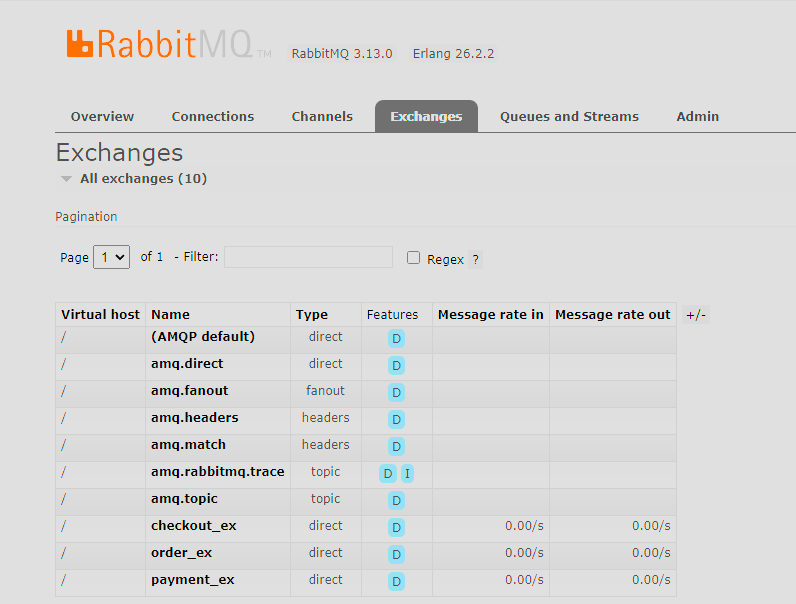
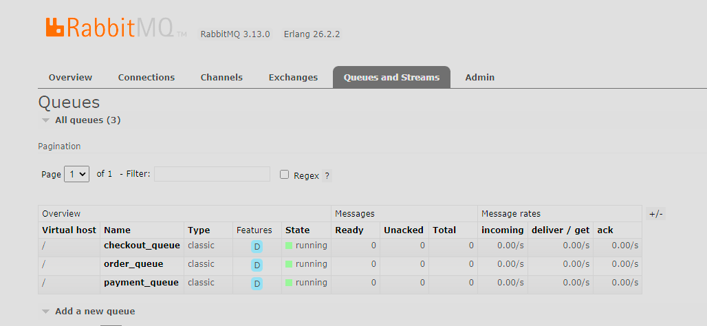
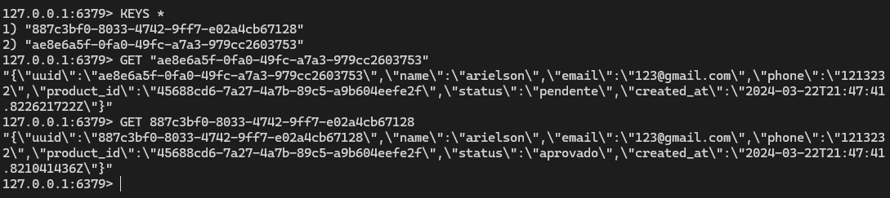

# micro-services-full

# Como subir o ambiente local do projeto

Este guia irá orientá-lo sobre como executar um projeto usando Docker Compose. Docker Compose é uma ferramenta para definir e executar aplicações Docker multi-contêineres. Com ele, você pode usar um arquivo YAML para configurar os serviços da sua aplicação e, em seguida, iniciar todos os serviços com um único comando.

## Pré-requisitos

- Ter o Docker instalado na sua máquina. Se você ainda não tem o Docker instalado, você pode baixá-lo e instalá-lo a partir do [site oficial do Docker](https://www.docker.com/products/docker-desktop).
- Ter um arquivo `docker-compose.yml` válido no diretório do seu projeto. Este arquivo define os serviços, redes e volumes da sua aplicação.

## Passos para Executar o Docker Compose

1. **Abra o Terminal**: Abra o terminal ou prompt de comando no seu computador.

2. **Navegue até o Diretório do Projeto**: Use o comando `cd` para navegar até o diretório que contém o arquivo `docker-compose.yml` do seu projeto.


3. **Execute o Docker Compose**: No diretório do projeto, execute o seguinte comando para iniciar os serviços definidos no seu arquivo `docker-compose.yml`:
    ```bash
    docker-compose up
    ```


    Este comando irá construir, (re)criar, iniciar e anexar aos contêineres definidos no arquivo `docker-compose.yml`. Se você quiser executar os contêineres em segundo plano, você pode adicionar a opção `-d`:
    ```bash
    docker-compose up -d
    ```
## Configurar o RabbitMQ

1. Acesse o RabbitMQ através do navegador:
   - URL: [http://localhost:15672](http://localhost:15672)
   - Credenciais: 
     - Username: `rabbitmq`
     - Password: `rabbitmq`

2. Após o login, crie as exchanges necessárias:
   - `checkout_ex`
   - `order_ex`
   - `payment_ex`

    
3. Faça o binding das exchanges criadas com as queues correspondentes:
   - `checkout_ex` com `checkout_queue`
   - `order_ex` com `order_queue`
   - `payment_ex` com `payment_queue`
    
## Testar os Microsserviços

1. Acesse a rota abaixo para listar todos os produtos disponíveis:
   - **Método:** GET
   - **URL:** [http://localhost:8081/products](http://localhost:8081/products)

2. Escolha um ID de produto da lista retornada.

3. Acesse a rota abaixo para visualizar os detalhes do produto escolhido:
   - **Método:** GET
   - **URL:** [http://localhost:8082/45688cd6-7a27-4a7b-89c5-a9b604eefe2f](http://localhost:8082/45688cd6-7a27-4a7b-89c5-a9b604eefe2f)

4. Preencha os campos necessários e clique em "Finalizar" para realizar o checkout.

5. Verifique se o pedido foi salvo no Redis com o status "pendente":
    Verifica todos os containers usando o comando:
    ```bash
    docker ps
    ```
    Acesse o container do Redis executando o comando substituindo {containerID} pelo id do container do redis:
     ```bash
     docker exec -it {containerID} bash
     ```
    Em seguida, entre no console do Redis digitando:
     ```bash
     redis-cli
     ```
    Para visualizar todas as chaves armazenadas no Redis, execute o comando:
     ```bash
     KEYS '*'
     ```
    Anote o ID da chave correspondente ao pedido que você acabou de realizar.

    Para visualizar os detalhes desse pedido, execute o comando substituindo `{key}` pelo ID da chave:
     ```bash
     GET {key}
     ```
Você verá duas chaves no Redis: uma com status "pendente" e outra com status "aprovado". Veja neste exemplo abaixo o output esperado.

